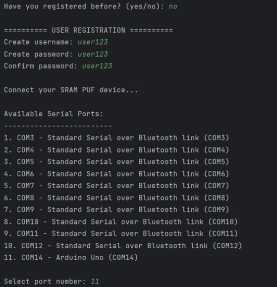
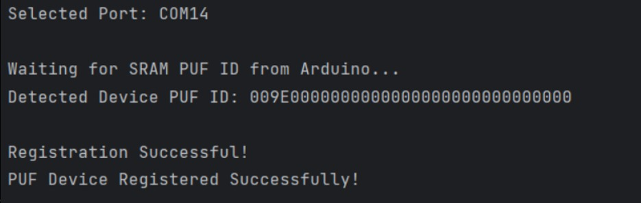
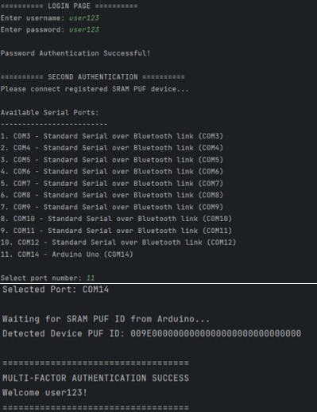
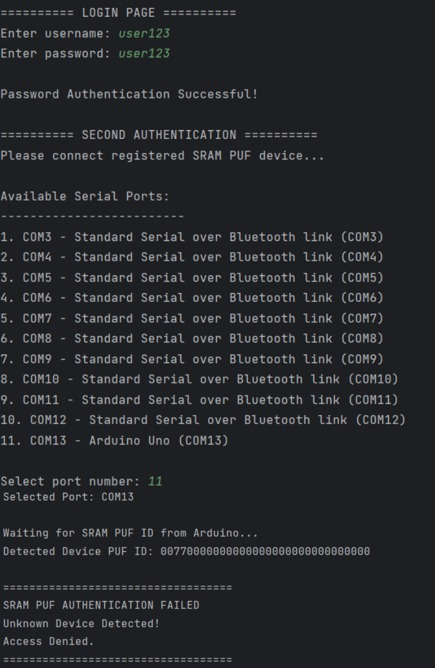

# SRAM PUF Multi-Factor Authentication System

A multi-factor authentication (MFA) prototype developed using **Python** and an **Arduino UNO R3**.

The system combines password-based authentication with hardware-based authentication. During registration, the user's password is hashed and a device identifier obtained from the Arduino is associated with the account. During login, both the password and the connected Arduino device must be successfully verified before access is granted.

---

## Project Overview

This project demonstrates a two-factor authentication system consisting of:

1. **Password Authentication** — The user's password is hashed using SHA-256 and compared with the stored password hash.
2. **Hardware Authentication** — The Python application communicates with an Arduino UNO R3 through a serial connection and retrieves its device identifier.

Access is granted only when both authentication factors are successfully verified.

The system therefore combines:

* **Something the user knows** — Password
* **Something the user possesses** — Registered Arduino device

---

## Features

* User registration and login
* Password confirmation during registration
* SHA-256 password hashing
* CSV-based user data storage
* Detection of available serial/COM ports
* Arduino UNO R3 port selection
* Python-to-Arduino serial communication using PySerial
* Hardware device registration
* Hardware-based second-factor authentication
* Detection of an incorrect hardware device
* Successful and failed MFA verification

---

## Technologies Used

| Technology           | Purpose                                      |
| -------------------- | -------------------------------------------- |
| Python               | Main authentication application              |
| Arduino C/C++        | Arduino firmware                             |
| Arduino UNO R3       | Hardware authentication device               |
| PySerial             | Python-Arduino serial communication          |
| SHA-256              | Password hashing                             |
| CSV                  | User authentication data storage             |
| EEPROM               | Persistent Arduino device identifier storage |
| Serial Communication | Communication between Python and Arduino     |

---

## Project Structure

```text
sram-puf-mfa-authentication/
│
├── src/
│   ├── python/
│   │   └── authentication_system.py
│   │
│   └── arduino/
│       └── sram_puf_device.ino
│
├── screenshots/
│   ├── registration-port-selection.jpeg
│   ├── registration-success.jpeg
│   ├── login-success.jpeg
│   └── login-failed-wrong-device.jpeg
│
├── sample/
│   └── database_sample.csv
│
├── README.md
├── requirements.txt
├── .gitignore
└── LICENSE
```

---

## How It Works

### Registration

During registration:

1. The user selects that they have not registered before.
2. The user creates a username and password.
3. The password is confirmed.
4. The application displays the available serial ports.
5. The user selects the COM port connected to the Arduino UNO R3.
6. Python requests the device identifier from the Arduino.
7. The password is hashed using SHA-256.
8. The username, password hash, and hardware identifier are stored for authentication.

### Login

During login:

1. The user enters their username and password.
2. The entered password is hashed and compared with the stored password hash.
3. If the password is correct, password authentication succeeds.
4. The application asks for the registered hardware device.
5. The user selects the Arduino's serial port.
6. The application retrieves the device identifier from the Arduino.
7. The detected identifier is compared with the registered identifier.
8. Access is granted only when the hardware identifiers match.

---

## Demonstration

### 1. Registration Process

The registration process begins when the user selects that they have not registered before. The user then creates a username and password and confirms the password.

After entering the account information, the system asks the user to connect the SRAM PUF device. The application detects the available serial ports and displays them for selection.



The user then selects the COM port associated with the connected Arduino UNO R3. After the correct port is selected, the Python application communicates with the Arduino and retrieves its device identifier.

The detected device identifier is associated with the newly created user account. Once the process is completed, the system displays **Registration Successful** and confirms that the PUF device has been registered successfully.



---

### 2. Successful Login Attempt

During login, the user enters the correct username and password. After the password is successfully verified, the system proceeds to the second authentication stage.

The user selects the COM port of the registered Arduino UNO R3, and the application retrieves its device identifier. When the detected device identifier matches the identifier stored during registration, multi-factor authentication succeeds and access is granted.



---

### 3. Failed Login Attempt

The system is also tested using a different Arduino device.

In this scenario, the correct username and password are entered, so password authentication succeeds. However, the device identifier retrieved from the connected Arduino does not match the identifier registered to the user account.

As a result, the SRAM PUF authentication fails and access is denied.



This demonstrates that knowing the correct username and password alone is not sufficient to gain access. The registered hardware device is also required to successfully complete the multi-factor authentication process.


---

## Installation

### Prerequisites

To run the project, you need:

* Python 3
* Arduino IDE
* Arduino UNO R3
* USB cable
* PySerial

### Clone the Repository

```bash
git clone https://github.com/YOUR-USERNAME/sram-puf-mfa-authentication.git
```

Navigate into the repository:

```bash
cd sram-puf-mfa-authentication
```

### Install Dependencies

Install the required Python dependency:

```bash
pip install -r requirements.txt
```

The `requirements.txt` file contains:

```text
pyserial>=3.5
```

---

## Arduino Setup

1. Connect the Arduino UNO R3 to the computer.
2. Open `src/arduino/sram_puf_device.ino` using the Arduino IDE.
3. Select **Arduino Uno** as the board.
4. Select the correct COM port.
5. Upload the program to the Arduino.
6. Close the Arduino Serial Monitor before running the Python application.

The Python application communicates with the Arduino at a baud rate of **9600**.

---

## Running the Application

Navigate to the Python source directory:

```bash
cd src/python
```

Run the program:

```bash
python authentication_system.py
```

The application will ask:

```text
Have you registered before? (yes/no):
```

Enter `no` to register a new account or `yes` to log in with an existing account.

---

## Authentication Logic

The system requires both authentication factors to succeed:

| Password  | Arduino Device    | Result         |
| --------- | ----------------- | -------------- |
| Correct   | Registered device | MFA Successful |
| Correct   | Different device  | Access Denied  |
| Incorrect | Registered device | Access Denied  |
| Incorrect | Different device  | Access Denied  |

---

## Security Features

### Password Hashing

Passwords are hashed using the SHA-256 hashing algorithm before being stored.

The application compares password hashes rather than directly comparing plaintext passwords.

### Hardware-Based Authentication

After successful password authentication, the application retrieves the identifier from the connected Arduino.

The detected identifier must match the identifier registered to the user account before access is granted.

### Two Authentication Factors

The system combines:

```text
Password
   +
Registered Arduino Device
   ↓
Multi-Factor Authentication
```

Possession of only one factor is insufficient for successful authentication.

---

## Limitations

This project is an educational prototype and is not intended for production use.

Current limitations include:

* SHA-256 is used directly for password hashing.
* User information is stored in a CSV file.
* The hardware authentication mechanism relies on a persistent device identifier.
* Serial communication between Python and the Arduino is not encrypted.
* The system does not currently implement account lockout after repeated failed attempts.

For a production system, a dedicated password hashing algorithm such as **Argon2**, **bcrypt**, or **scrypt** should be used together with a secure database and stronger hardware authentication mechanisms.

---

## Future Improvements

* Replace SHA-256 password hashing with Argon2 or bcrypt
* Add unique password salts
* Replace CSV storage with a secure database
* Add account lockout after repeated failed attempts
* Add authentication attempt logging
* Implement challenge-response hardware authentication
* Protect against replay attacks
* Improve automatic Arduino detection
* Add a graphical user interface
* Add user account management

---

## Learning Outcomes

This project provided practical experience with:

* Multi-factor authentication
* Hardware-based authentication
* Python programming
* Arduino programming
* Serial communication
* Password hashing
* Authentication system design
* Hardware and software integration
* Testing successful and unsuccessful authentication scenarios

---

## Disclaimer

This project was developed for educational purposes as a prototype for exploring multi-factor and hardware-based authentication concepts.

---

## License

This project is licensed under the **MIT License**. See the `LICENSE` file for details.
